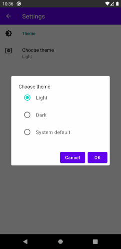
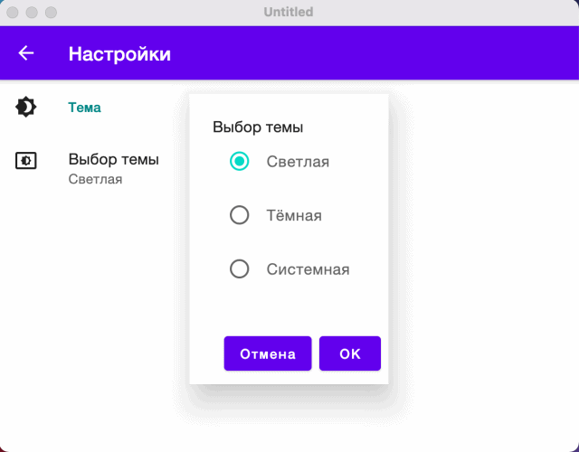

# Material Theme Preferences


[](https://github.com/softartdev/MaterialThemePrefs/actions/workflows/build_publish.yml)

Kotlin Multiplatform library for easy switching Dark/Light Material themes on [Compose](https://github.com/JetBrains/compose-jb).
Supported platforms:
- Android
- iOS
- Desktop JVM (MacOS, Linux, Windows)




## Usage
Call composable functions for material theme wrap, preferences items on settings screen, showing dialog for select theme.
```kotlin
@Composable
fun App() = PreferableMaterialTheme { // provides composition locals
    SettingsScaffold { // includes TopAppBar
        Box {
            Column {
                ThemePreferencesCategory() // subtitle
                ThemePreferenceItem() // menu item
            }
            themePrefs.showDialogIfNeed() // shows when menu item clicked
        }
    }
}
```
The [NoteDelight](https://github.com/softartdev/NoteDelight/blob/master/shared-compose-ui/src/commonMain/kotlin/com/softartdev/notedelight/ui/SettingsScreen.kt#L104) app is a real example.   
## Installation
The latest release is available on [Maven Central](https://repo1.maven.org/maven2/io/github/softartdev/theme-material/).
### Gradle
1. Add the Maven Central repository if it is not already there:
```kotlin
repositories {
    mavenCentral()
}
```
2. In multiplatform projects, add a dependency to the commonMain source set dependencies
```kotlin
commonMain {
    dependencies {
        implementation("io.github.softartdev:theme-material:$latestVersion") // Material Design 2
        implementation("io.github.softartdev:theme-material3:$latestVersion") // Material Design 3
        implementation("io.github.softartdev:theme-prefs:$latestVersion") // optional, if you need only preferences
    }
}
```
## Implementation
Used [moko-resources](https://github.com/icerockdev/moko-resources) library for many languages (currently Russian and English are supported).

Persisting preferences is implemented using [SharedPreferences](https://developer.android.com/reference/android/content/SharedPreferences) on Android, and [Java Preference API](https://docs.oracle.com/javase/7/docs/api/java/util/prefs/Preferences.html) on JVM Desktop.
```kotlin
// common:
expect var themeEnum: ThemeEnum

// android:
private val preferences: SharedPreferences = PreferenceManager.getDefaultSharedPreferences(context)

actual var themeEnum: ThemeEnum
    get() = preferences.getInt(THEME_KEY, ThemeEnum.SystemDefault.ordinal).let(ThemeEnum.values()::get)
    set(value) = preferences.edit().putInt(THEME_KEY, value.ordinal).apply()

// desktop java:
private var preferences: Preferences = Preferences.userNodeForPackage(ThemeEnum::class.java)

actual var themeEnum: ThemeEnum
    get() = preferences.getInt(THEME_KEY, ThemeEnum.SystemDefault.ordinal).let(ThemeEnum.values()::get)
    set(value) = preferences.putInt(THEME_KEY, value.ordinal)
```
Also used [composition local](https://developer.android.com/jetpack/compose/compositionlocal) for access from theme-scoped as an implicit way:
```kotlin
val themePrefs: ThemePrefs = LocalThemePrefs.current
```
